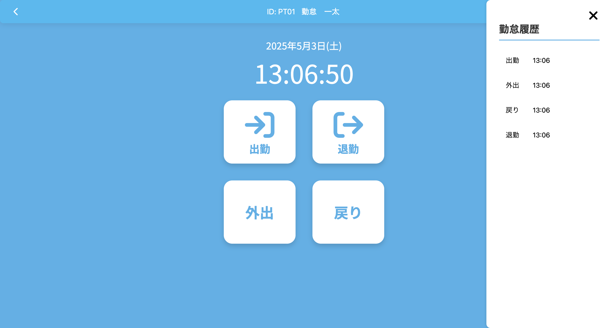

# DentalAttendance

## 環境構築

### 仮想環境の構築

```bash
python3.11 -m venv myvenv
source myenv/bin/activate
```

### 必要なパッケージのインストール

```bash
pip install -r requirements.txt
```

データベースの初期化

1. データベースの作成
```bash
cd DentalAttendance
flask db init
flask db migrate
flask db upgrade
```

2. 管理者アカウントの設定
必要であれば、環境変数で管理者ID(your_admin_id)とパスワード(your_admin_password)を設定します：
（初期設定は、管理者ID：id00、パスワード：pass00としている）
```bash
export ADMIN_ID=your_admin_id
export ADMIN_PASSWORD=your_admin_password
```

## アプリケーションの起動

1. アプリケーションの起動
```bash
cd DentalAttendance
python3 server.py
```

2. ブラウザでアクセス
```
http://127.0.0.1:5000
```

## 主な機能

### 1.従業員向け機能

#### ログイン画面


#### 勤怠登録
<table>
<tr>
<td><strong>正社員用</strong><br>出勤・退勤の登録</td>
<td><strong>パート用</strong><br>出勤・退勤・外出・戻りの登録</td>
</tr>
<tr>
<td></td>
<td></td>
</tr>
</table>

### 2.管理者向け機能

#### ログイン画面


#### 管理者画面


#### アカウント管理
<table>
<tr>
<td><strong>アカウント追加</strong></td>
<td><strong>アカウント管理</strong></td>
</tr>
<tr>
<td></td>
<td></td>
</tr>
</table>

#### レポート機能
<table>
<tr>
<td><strong>勤怠履歴</strong><br>表示とPDFダウンロード</td>
<td><strong>月次集計表</strong><br>表示とExcelダウンロード</td>
</tr>
<tr>
<td></td>
<td></td>
</tr>
</table>
