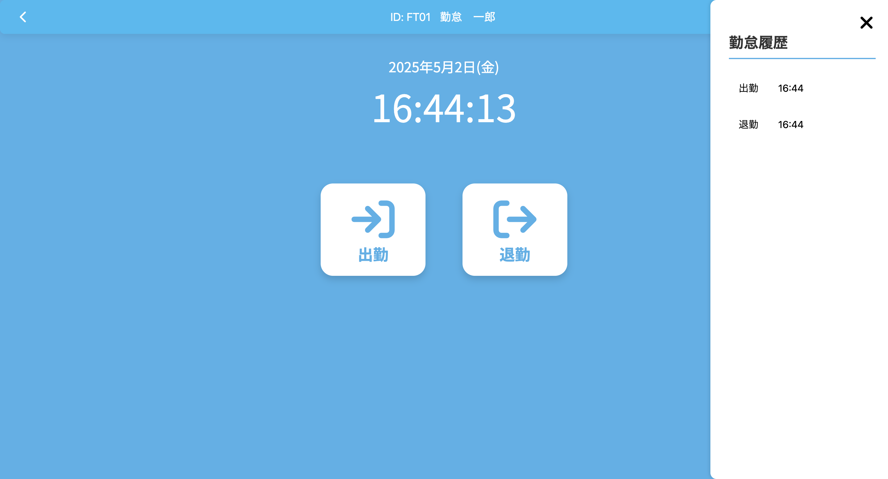
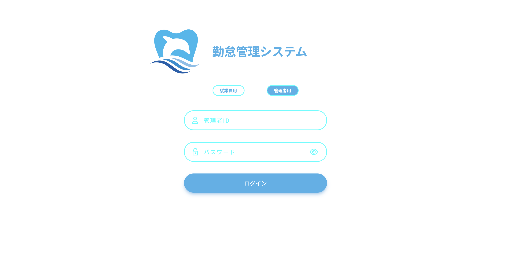
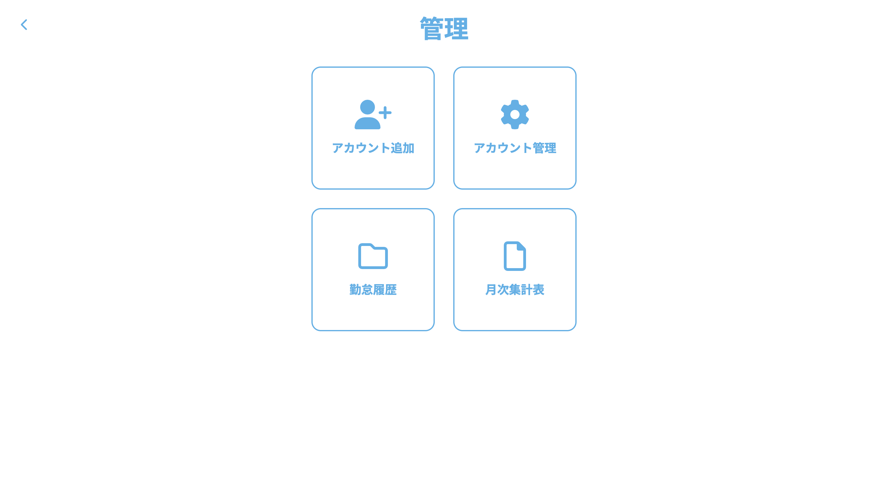
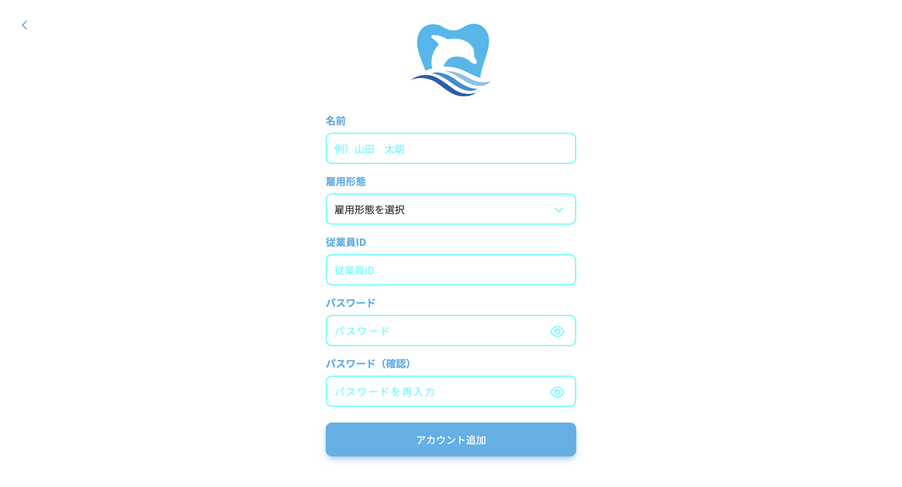
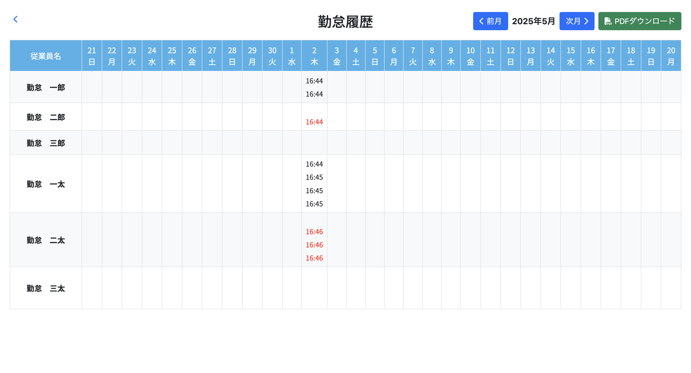
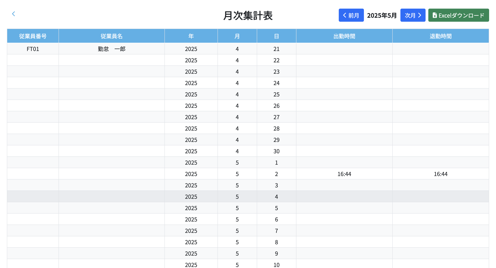
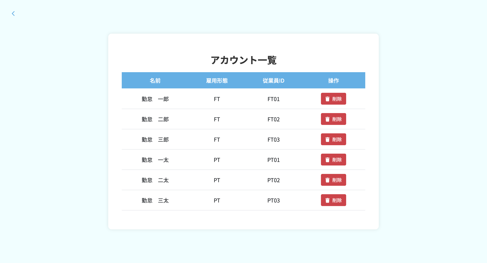

# DentalAttendance

## 環境構築

### 仮想環境の構築

```bash
python3.11 -m venv myvenv
source myenv/bin/activate
```

### 必要なパッケージのインストール

```bash
pip install -r requirements.txt
```

データベースの初期化

1. データベースの作成
```bash
cd DentalAttendance
flask db init
flask db migrate
flask db upgrade
```

2. 管理者アカウントの設定
必要であれば、環境変数で管理者ID(your_admin_id)とパスワード(your_admin_password)を設定します：
（初期設定は、管理者ID：id00、パスワード：pass00としている）
```bash
export ADMIN_ID=your_admin_id
export ADMIN_PASSWORD=your_admin_password
```

## アプリケーションの起動

1. アプリケーションの起動
```bash
cd DentalAttendance
python3 server.py
```

2. ブラウザでアクセス
```
http://127.0.0.1:5000
```

## 主な機能
- 従業員ログイン

- 正社員用の勤怠登録（出勤、退勤）

- パート用の勤怠登録（出勤、退勤、外出、戻り）

- 管理者ログイン

- 管理者画面

- アカウント追加

- 勤怠履歴（表示とPDFダウンロード）

月次集計表（表示とExcelダウンロード）

- アカウント管理（追加、削除）

